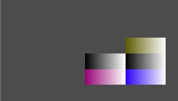

# AnimatedGridContainerPlugin (Godot 4 Port)

This is a Godot 4.4.1 port of the [AnimatedGridContainerPlugin](https://github.com/gmarais/AnimatedGridContainerPlugin) by [gmarais](https://github.com/gmarais).
It provides a more flexible `GridContainer` node that can fill its children from bottom to top and right to left.  
Animations are supported as well. 

It's not an actual plugin because that would be too much work for a single gd script: animated_grid_container.gd.

🎥 [Video Preview](https://www.youtube.com/watch?v=_RCcwMFoaJ0) (from the original repository)

---

## License
- Original project: MIT (© gmarais)  
- My minor changes: CC0 (public domain)  
